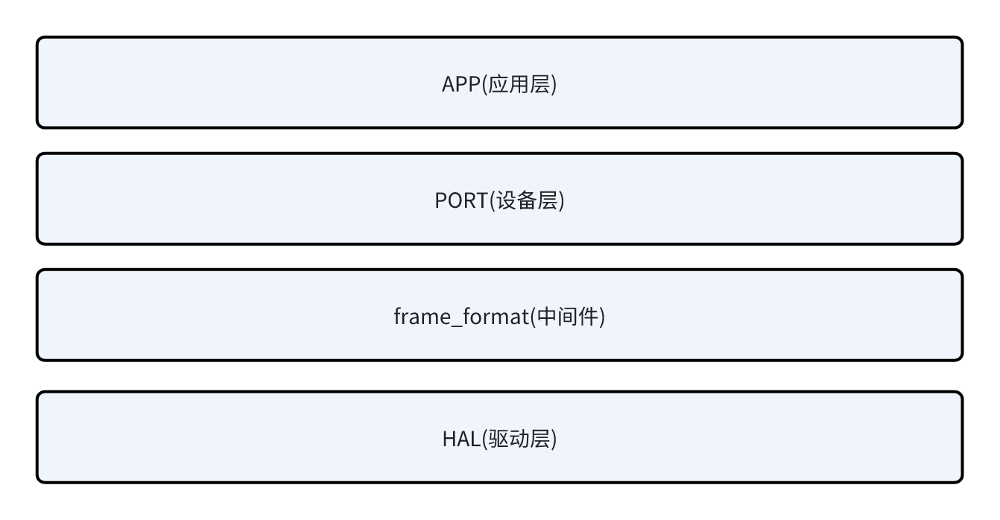

# UART设备使用说明

## 1. 介绍

考虑到日常开发和维护的便捷性，uart框架做如下分层设计：



- 驱动层：提供底层硬件驱动的接口，直接调用HAL库，实现外设的初始化、打开、关闭、发送数据、接收数据、中断回调处理等。
- 中间件：提供数据封装、校验、重发、数据包统计等功能。
- 设备层：提供设备的初始化、打开、关闭、发送数据、接收接口，供应用层调用。
- 应用层：用户调用设备层接口，实现应用层的业务逻辑。

uart框架的使用流程如下：

1. cubeMX配置硬件；
2. 驱动层(drv_uart.c)补全新增硬件代码；

```c
//drv_uart.c 83行
static uart_drv_t usart1;
static uart_drv_t uart5;
/*static uart_drv_t usartx;*/ /**<------ add other uart here*/

static uart_drv_t *uart_drv_get(UART_HandleTypeDef *huart)
{
    if (huart == NULL)
    {
        return NULL;
    }
    if (huart == &huart1)
    {
        return &usart1;
    }
    else if (huart == &huart5)
    {
        return &uart5;
    }
    else
    {
        /* add other uart here */ /**<------ add other uart here*/
    }
}
```

```c
//drv_uart.c 152行
static int8_t drv_uart_open(uart_dev_t *const self)
{
    if (self == NULL)
    {
        return -1;
    }
    uart_drv_t *uart_drv = (uart_drv_t *)self->user_data;
    if (uart_drv->huart == NULL)
    {
        return -2;
    }
    __disable_irq();
    if (!memcmp(uart_drv->dev.name, UART_DEV_NAME_CONSOLE, sizeof(UART_DEV_NAME_CONSOLE)))
    {
        MX_USART1_UART_Init();
    }
    else if (!memcmp(uart_drv->dev.name, UART_DEV_NAME_UART5, sizeof(UART_DEV_NAME_UART5)))
    {
        MX_UART5_Init();
    }
    else
    {
        /* add other uart here */ /**<------ add other uart here*/
    }
    /*...*/
}
```

```c
//drv_uart.c 382行
static int drv_uart_init(void)
{
    int32_t ret = drv_uart_register(uart_drv_get(&huart5),
                                    &huart5,
                                    UART_DEV_NAME_UART5,
                                    UART_TYPE_FULL_DUPLEX);
    if (ret != 0)
    {
        return -1;
    }
    /* add other uart here */ /**<------ add other uart here*/
    return 0;
}
```

3. 应用层调用设备层配置外设,可配置是否使用frame_format中间件,默认不启用，启用后会进行数据帧格式解包封装、应答超时重发、数据包统计等功能；

- frame_format封装帧格式：
  - 请求帧格式：

      | 定义        | 字节数       | 备注   |
      | ----------- | ----------- |----------- |
      | header      | 2B       | 固定为0x55 0xAA   |
      | count       | 2B |表示当前帧序号，从0开始，每发送一帧递增1，溢出时归零继续计数 |
      | data len    | 2B    | 表示数据长度    |
      | data        | N | 用户数据 |
      | crc32       | 4B | 表示数据校验值，采用CRC32算法， polynomial=0x04C11DB7, init=0xFFFFFFFF, xor=0xFFFFFFFF，计算时，包含count、data len、data三个字段 |

  - 应答帧格式：

      | 定义        | 字节数       | 备注   |
      | ----------- | ----------- |----------- |
      | header      | 2B       | 固定为0x55 0xAA   |
      | count       | 2B |同请求帧count |
      | data len    | 2B    | 0x01    |
      | data        | 1B | 0x00 |
      | crc32       | 4B | -- |

  ***<font color=red size=3>注意：frame_format中间件默认不启用，需要在应用层调用device_uart_config()接口设置use_frame_format为true，才会启用该中间件,启用后解包封装、应答、重发等功能才会生效</font>***

4. 应用层调用设备层读写,调用中间件获取数据统计；

## 2. 接口说明

### 2.1 设备层接口

#### 2.1.1 device_uart_find()

```c
uart_dev_t *device_uart_find(char const *name);
```

该函数用于寻找UART设备。

- 参数：

  - name：UART设备名
    -

    ```c
    #define UART_DEV_NAME_CONSOLE "console(USART1)"
    #define UART_DEV_NAME_USART2 "USART2"
    #define UART_DEV_NAME_USART3 "USART3"
    #define UART_DEV_NAME_UART4 "UART4"
    #define UART_DEV_NAME_UART5 "UART5"
    #define UART_DEV_NAME_USART6 "USART6"
    #define UART_DEV_NAME_UART7 "UART7"
    #define UART_DEV_NAME_UART8 "UART8"
    #define UART_DEV_NAME_UART9 "UART9"
    #define UART_DEV_NAME_USART10 "USART10"
    ```

- 返回值：
  - 成功：UART设备句柄。
  - 失败：NULL。

#### 2.1.2 dev_uart_init()

```c
device_err_t dev_uart_init(uart_dev_t *dev, uint16_t oflags, uint32_t queueSpace, uint32_t queueMsgSize);
```

该函数用于初始化UART设备。

- 参数：
  - dev：UART设备句柄。
  - oflags：操作标志，目前只支持DEV_UART_IOCTL_USE_DMA。
  - queueSpace：接收队列空间大小。
  - queueMsgSize：接收队列消息大小，由于使用空闲中断接收数据，该参数设置是需大于实际要接收的数据包大小，最好是接收数据包大小的2倍。

- 返回值：
  - 成功：0。
  - 失败：负数。

#### 2.1.3 dev_uart_deinit()

```c
device_err_t dev_uart_deinit(uart_dev_t *dev);
```

该函数用于关闭UART设备。

- 参数：
  - dev：UART设备句柄。

- 返回值：
  - 成功：0。
  - 失败：负数。

#### 2.1.4 dev_uart_send()

```c
device_err_t dev_uart_send(uart_dev_t *dev, uint8_t *buf, uint16_t len, uint32_t timeout);
```

该函数用于向UART设备发送数据。

- 参数：
  - dev：UART设备句柄。
  - buf：待发送数据指针。
  - len：待发送数据大小。
  - timeout：超时时间。

- 返回值：
  - 成功：0。
  - 失败：负数。

  #### 2.1.5 dev_uart_recv()

```c
device_err_t dev_uart_recv(uart_dev_t *dev, uint8_t *buf, uint16_t len, uint32_t timeout);
```

该函数用于从UART设备接收数据。

- 参数：
  - dev：UART设备句柄。
  - buf：接收数据指针。
  - len：接收数据大小，使用空闲中断方式，该参数暂不起作用。
  - timeout：超时时间。

- 返回值：
  - 成功：0。
  - 失败：负数。

#### 2.1.6 dev_uart_config()

```c
device_err_t dev_uart_config(uart_dev_t *dev, int cmd, void *arg);
```

该函数用于UART设备控制。

- 参数：
  - dev：UART设备句柄。
  - cmd：控制命令。
    - DEV_UART_IOCTL_SET_FRAME_FORMAT：设置中间件参数。

  - arg：控制参数
      -

    ```c
    typedef struct frame_format_arg
    {
        bool use_frame_format; /* enable or disable frame format */
        bool crc_check_state;  /* enable or disable crc check */
        uint8_t retry_count;   /* retry count */
        uint32_t timeout_ms;   /* timeout in ms */
    } frame_format_arg_t;
    
- 返回值：
  - 成功：0。
  - 失败：负数。
