## 1. 文档说明
- 本demo针对新增片上外设，且不需要设备驱动情况时，工程修改参考
- 本demo拟实现如下功能：
  - 使用TIM6，中断周期为0.1ms，从而提供时间基准供FreeRTOS进行任务运行耗时统计
  - TIM6不占用GPIO，且不被业务需求依赖，故按工程拟定的原则，需要将其初始化放置到**main**函数内部
  - 基础分支hash: 8f895773ff55a79bed5662de1b436ddf827d4cd4
  - demo分支hash: 1b43d79b5e6d06a3eaa587a3097d763b7057e294
  
## 2. 修改方式
- 使用STM32CubeMX构建TIM6配置
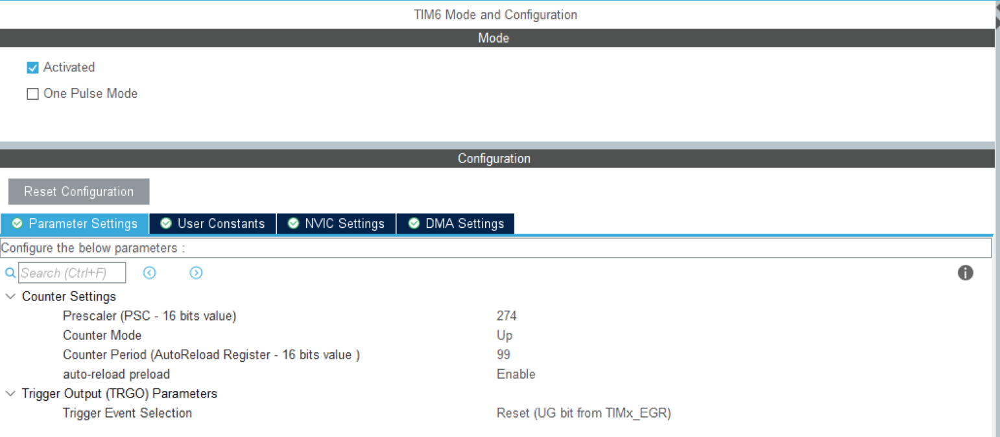

- 生成工程，并筛选TIM6相关代码文件
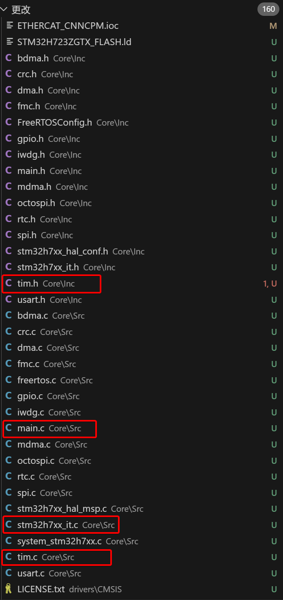

- 将步骤2中文件与原文件对比，差异部分拷贝到相应的原文件中
  > main.c
  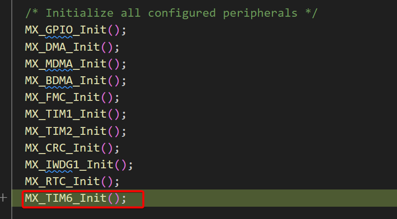
  
  > stm32h7xx_it.c
  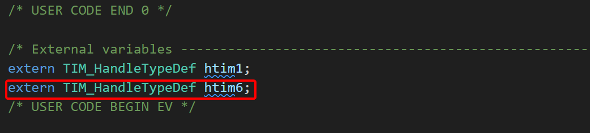
  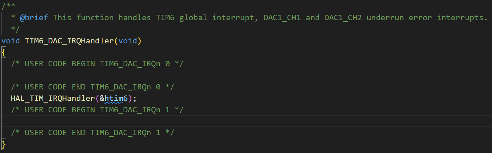

  > tim.c
  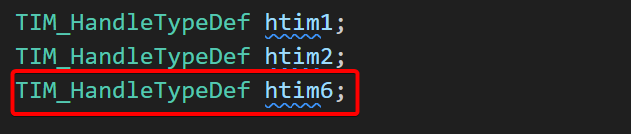
  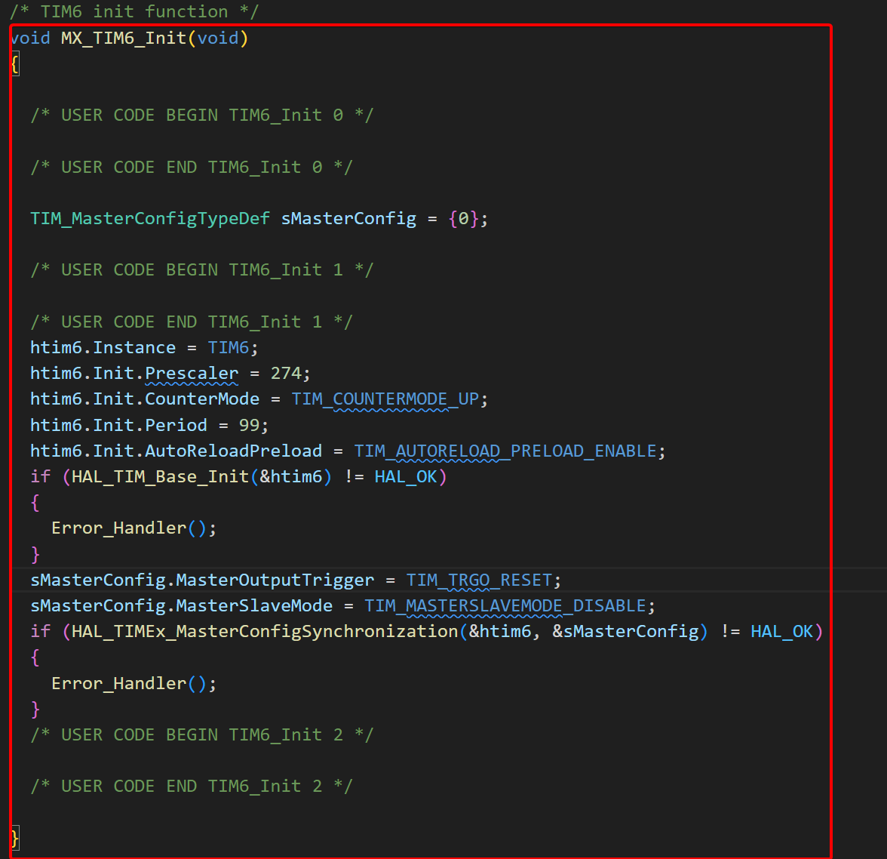
  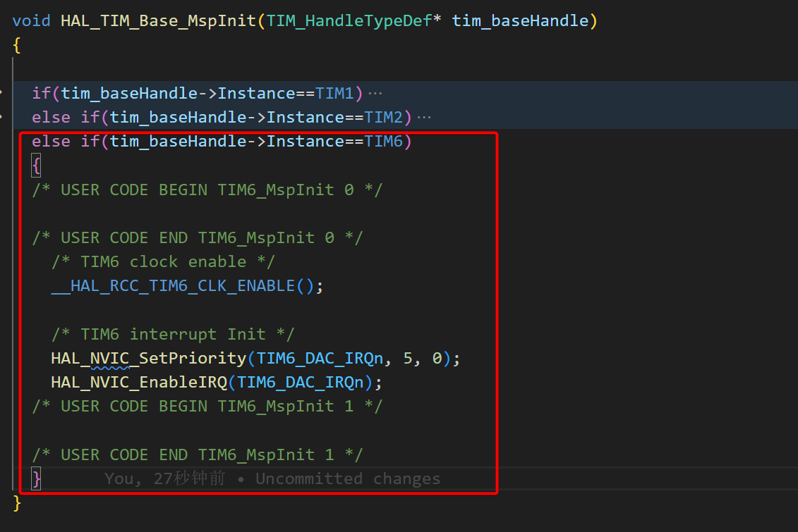
  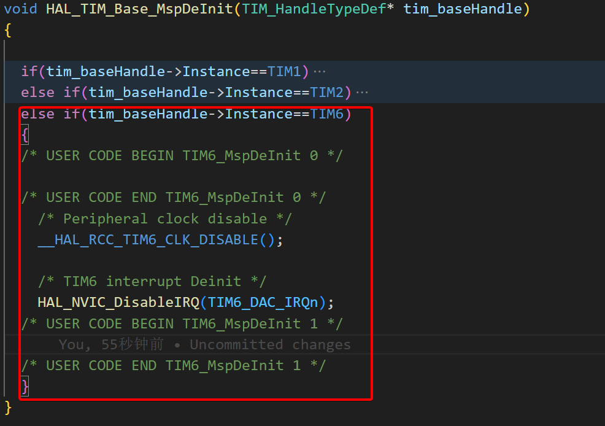

  > tim.h
  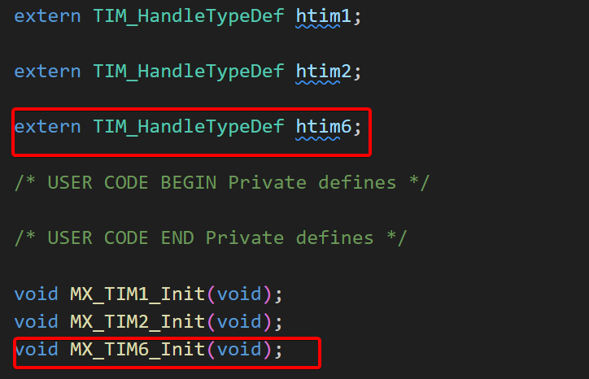

- 重新加载运行cmakelist.txt，以更新makefile文件

- 编译文件，结果如下
  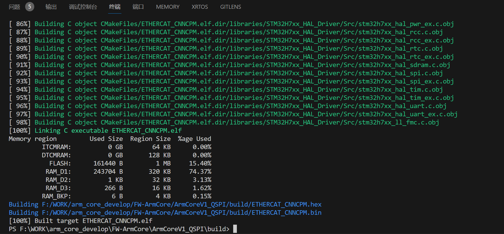
  
- 添加代码：启动TIM6，并于中断中添加打印测试
  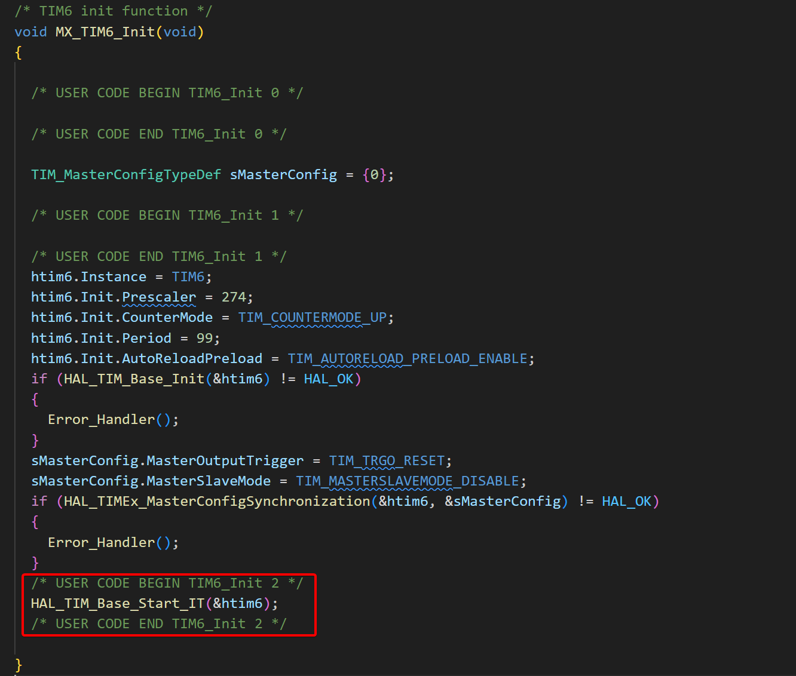
  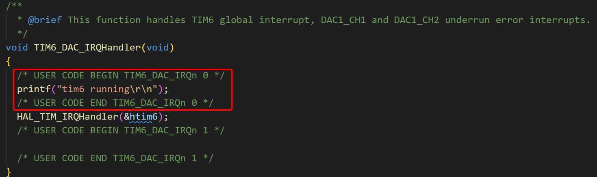

- 结果如下
  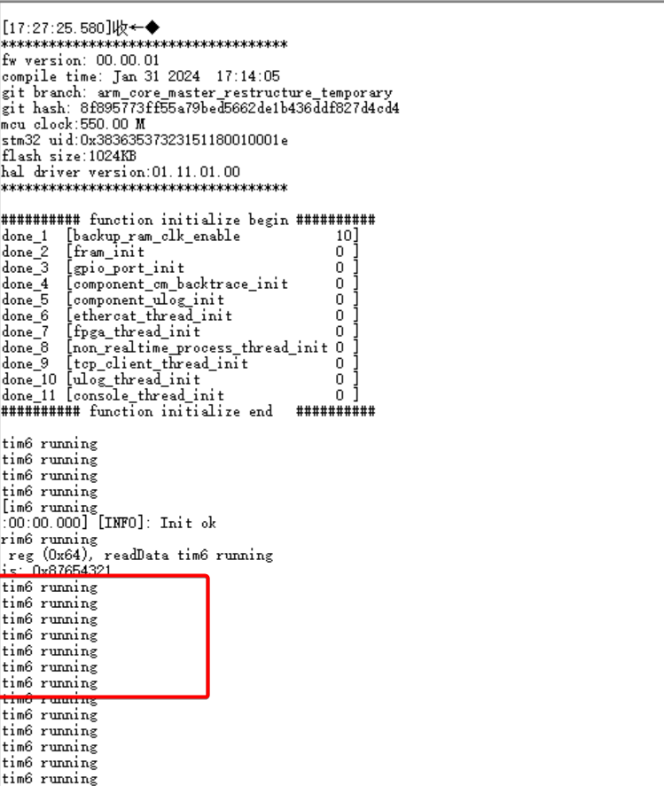

- 最后，添加FreeRTOS统计功能函数及实现函数即可
  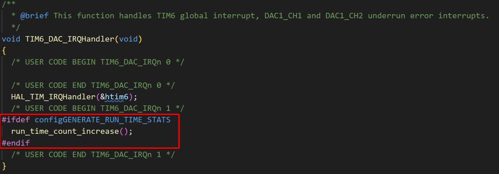