## 1. 文档说明
- 本demo针对新增片上外设，需要设备驱动情况时，工程修改参考
- 本demo拟实现如下功能：
  - 使用TIM7，定时周期为1us，每次定时溢出触发一次DMA数据搬运（memory->peripheral）
  - TIM+DMA组合方式，可以控制GPIO以任意频率/波特率输出数据(本demo定时周期为1us，故波特率为1Mbps)，从而实现使用GPIO模拟UART、I2C、SPI等串行总线通信
  - 基础分支hash: 1b43d79b5e6d06a3eaa587a3097d763b7057e294
  - demo分支hash: 9d09b3435ad3ef6e45b67527b28c197344b30750
  
## 2. 修改方式
- 使用STM32CubeMX工具配置TIM7、DMA、GPIOD_5
  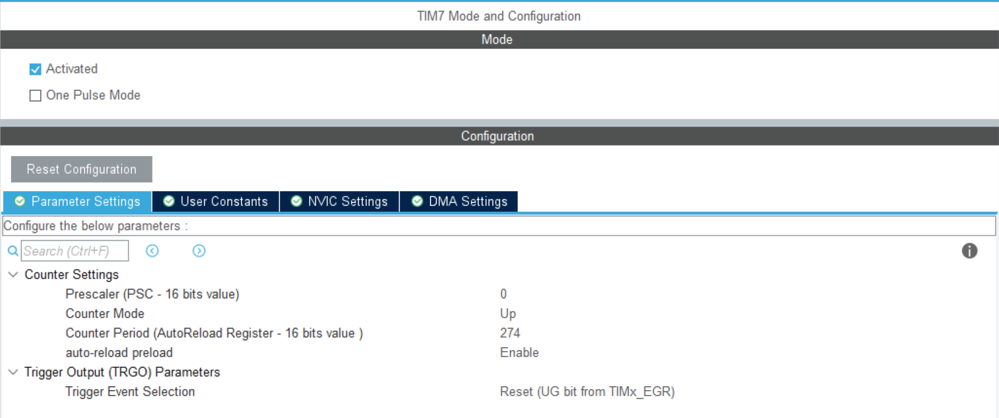
  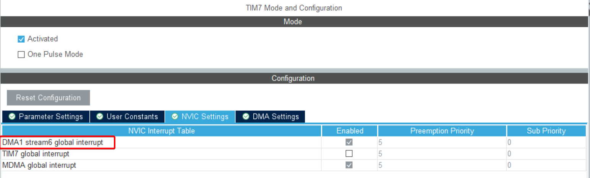
  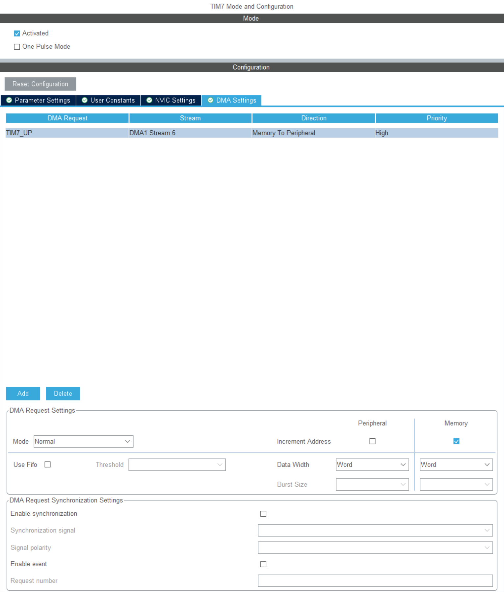
  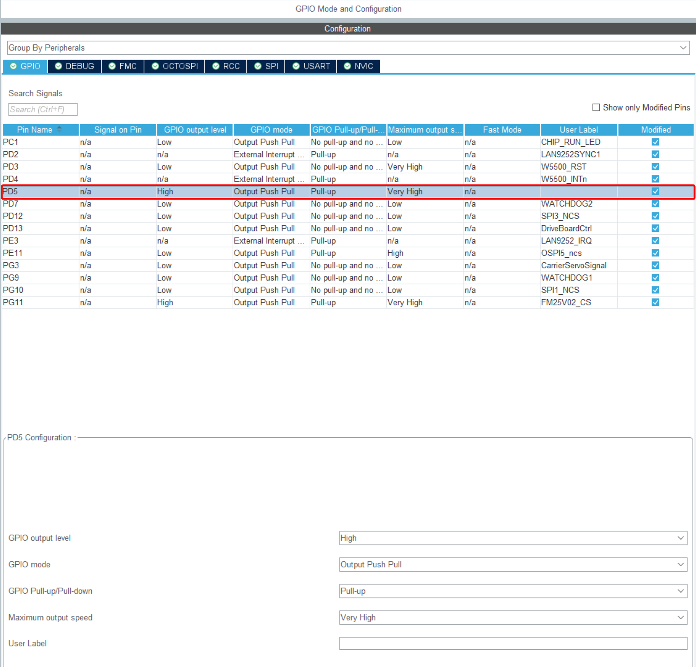

- 生成代码，找到与TIM7、DMA相关的头文件和源文件，对比修改工程前的相应文件，并拷贝差异部分
  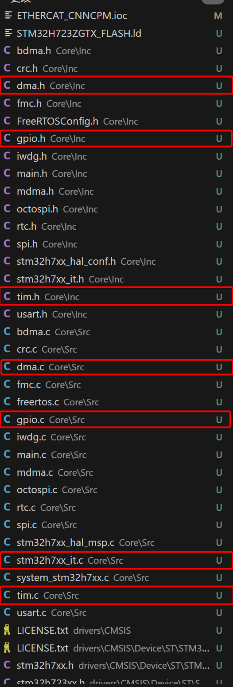

- 拷贝差异部分至相应的原代码文件，并根据业务需求确定句柄、函数是否添加到头文件中
  > dma.c
  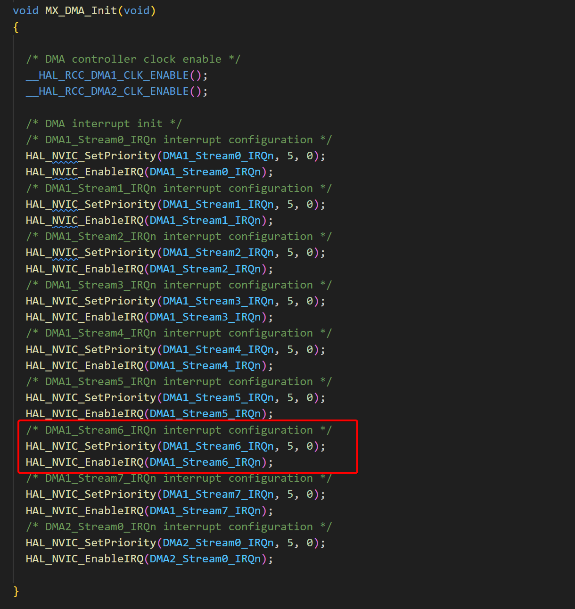

  > gpio.c
  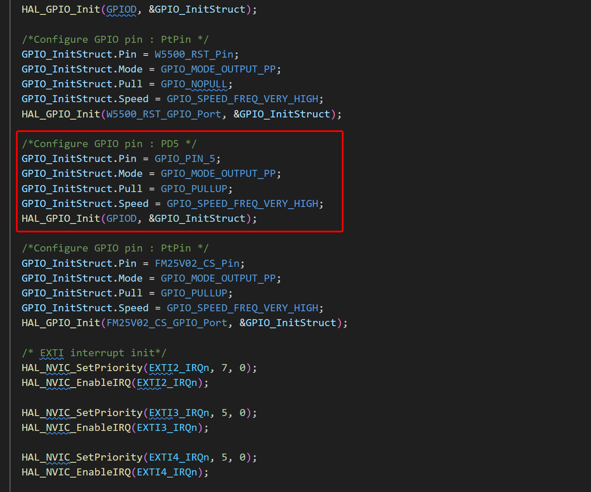

  > tim.c
  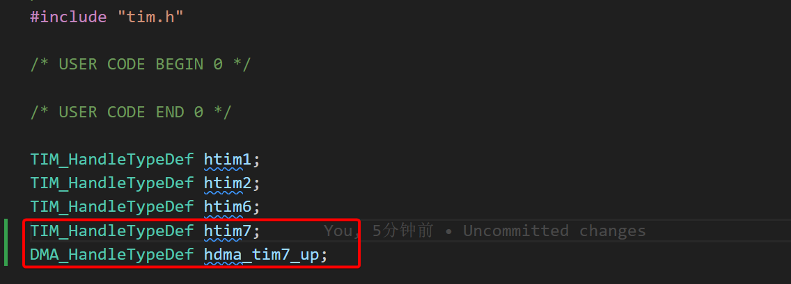
  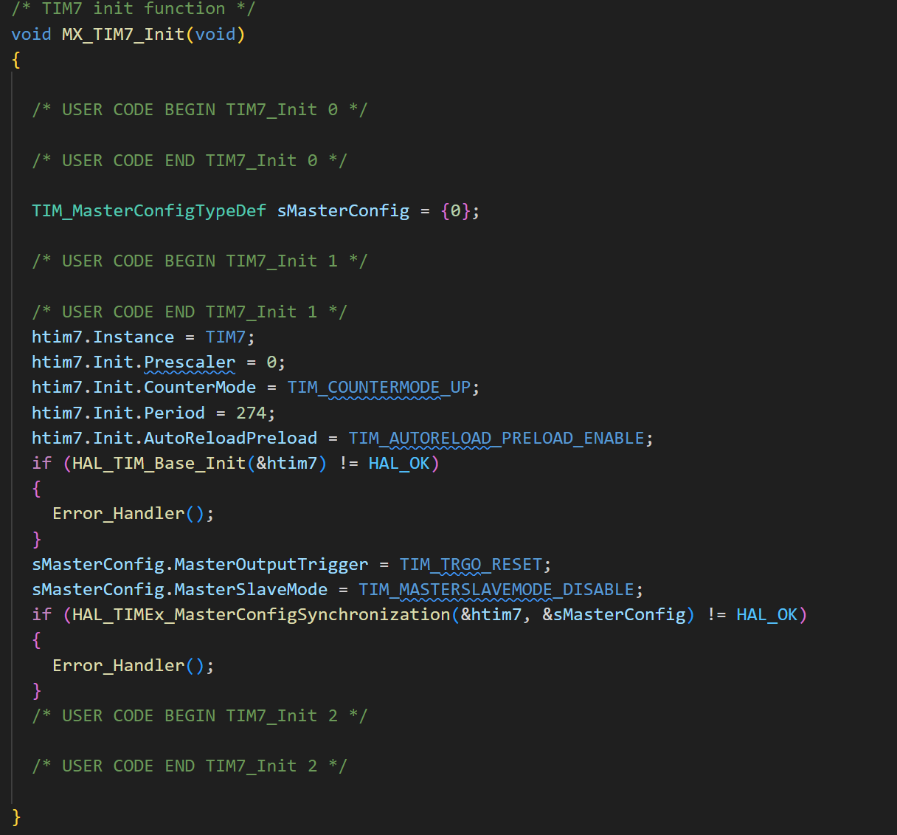
  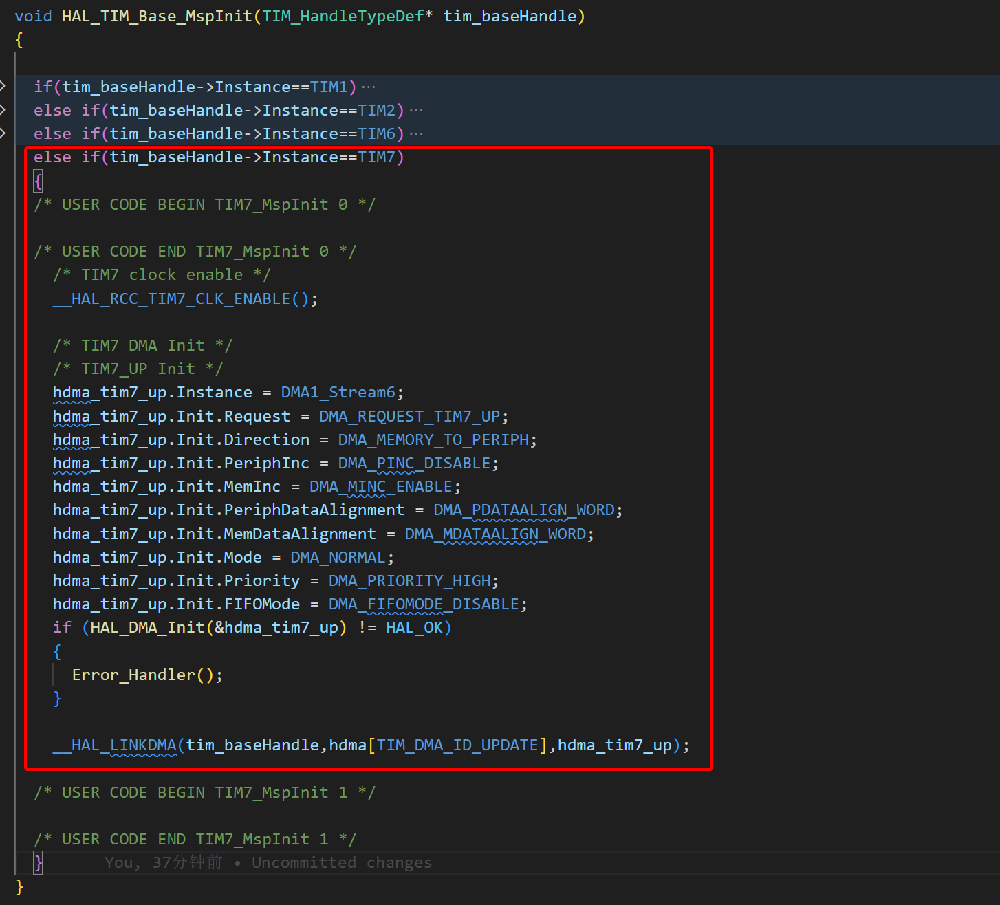
  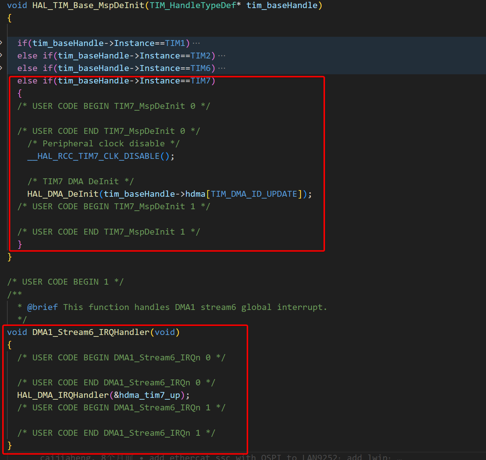

  > tim.h
  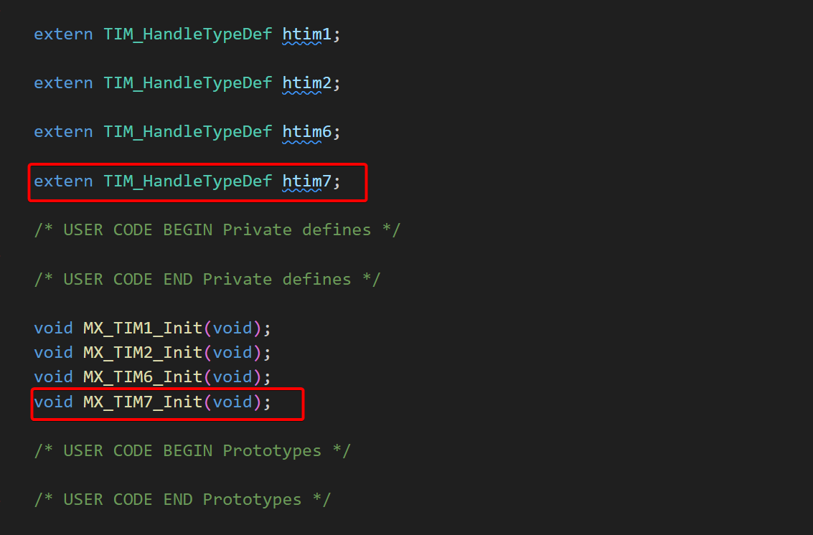

- 重新加载运行cmakelist.txt，以更新makefile文件

- 编译文件，结果如下
  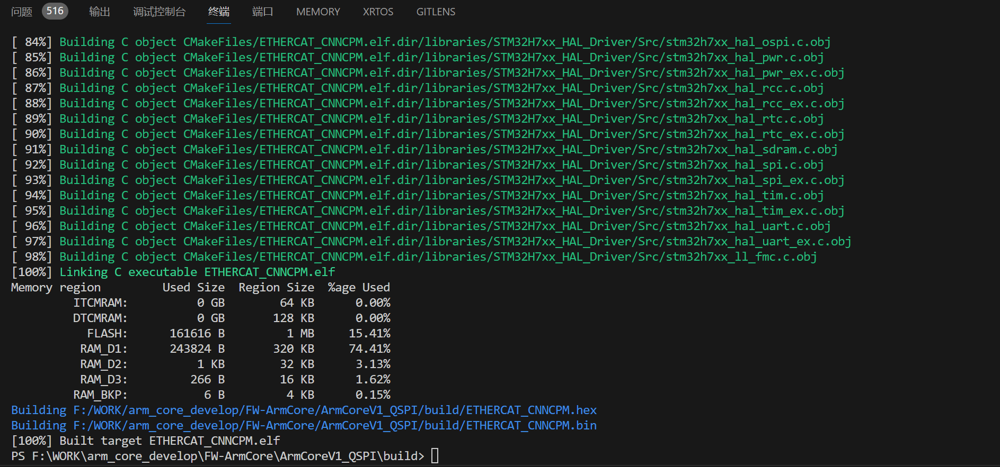

- 接口功能开发：添加TIM7、DMA初始化配置函数，GPIO输出控制接口函数，详见`gpio_imitate.c`和`gpio_imitate.h`文件，并根据需要添加编译文件至cmakelist.txt中
