## 1. 文档说明
- 本demo针对业务变更情况，此时需要更改片上外设功能配置，并需要编写设备驱动、接口程序
- 本demo拟实现如下功能：
  - 将`ethercat`周期性`ECAT_CheckTimer()`功能的时基由`TIM2`变更为`TIM5`
  - 将`TIM2`配置为编码器模式，对外部编码器脉冲进行计数
  - 基础分支：a13a11836aeb6d78a91e6443d3cc124d17173a15
  - demo分支：5768bb37671aadfa51188df45e0a8719115772ad
  
## 2. 修改方式
- 配置`TIM5`，参数与`TIM2`保持一致
    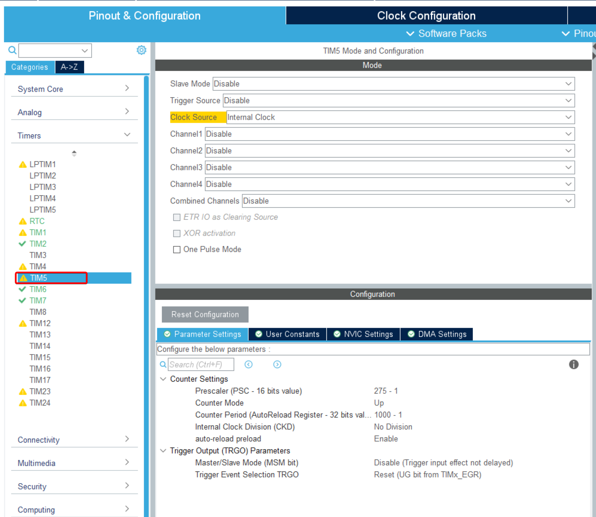

- 修改`TIM2`为编码器模式，并配置编码器输入引脚为`PA0`和`PA1`
    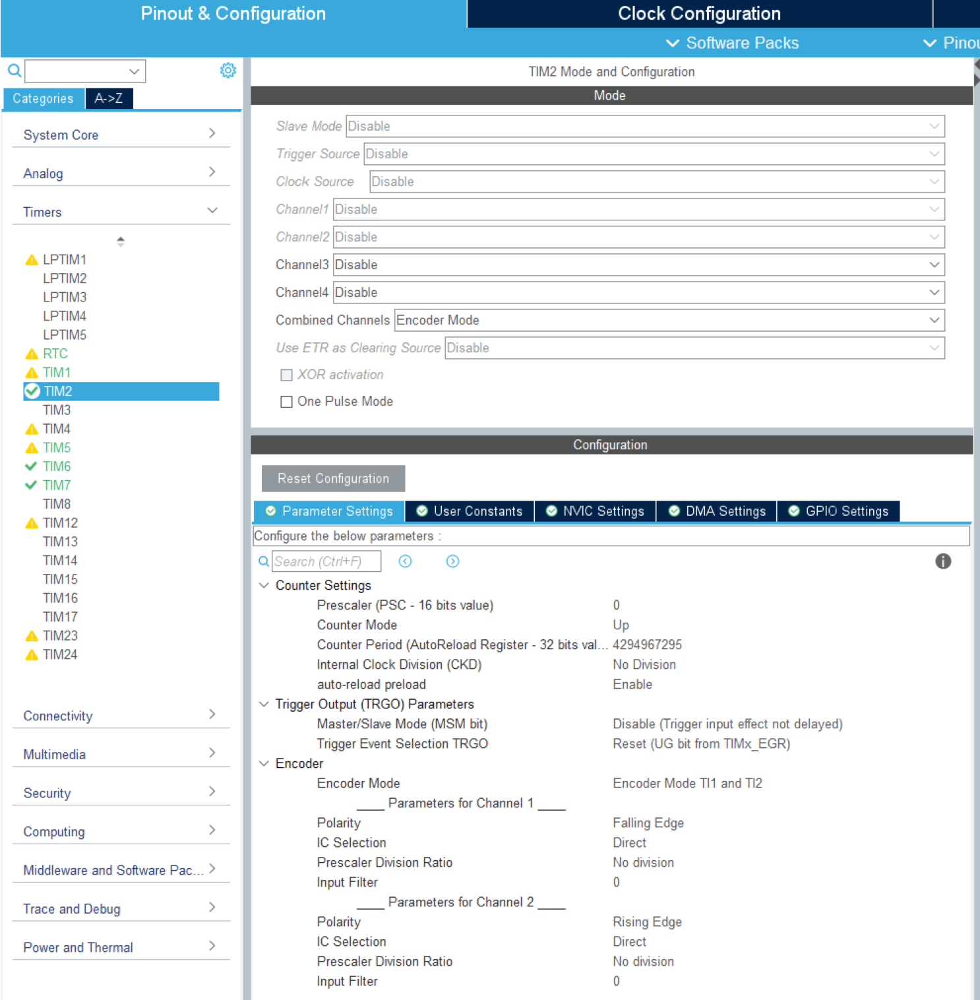

- `STM32CubeMX`重新生成代码，在使用`GIT`管理工程项目时，可看到新生成的工程相对于原工程有149个文件变更。在工程目录下，可发现新增/更改的文件或文件夹后面有**点状**或者**M/U/D**字符样式标识，即表示相关文件或目录下有新增/修改内容
    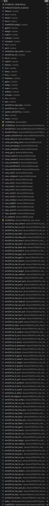

    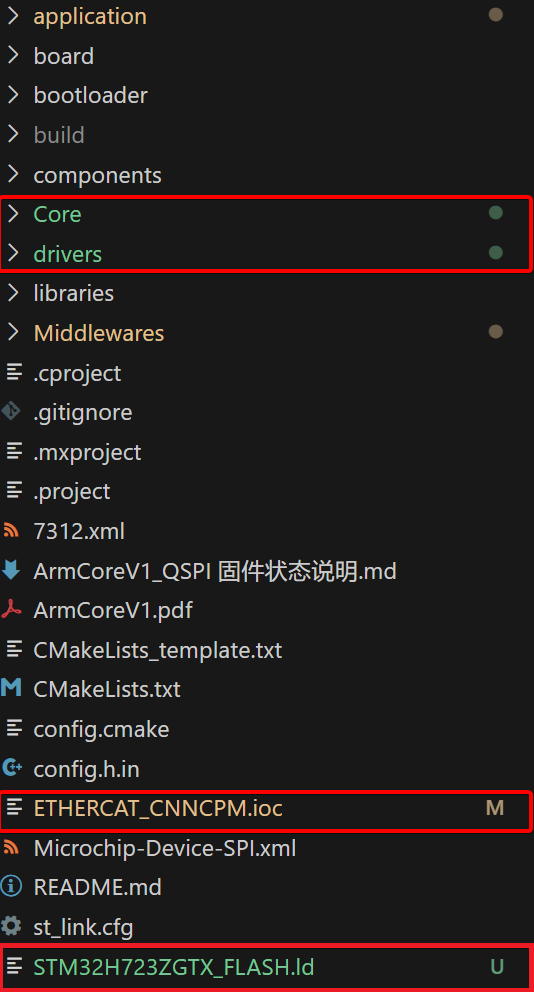

- 将工程`drivers`目录下`CMSIS`和`STM32H7xx_HAL_Driver`文件夹剪切到`libraries`目录下，直接合并替换`libraries`目录下原有的文件。经上述操作后，可看到差异文件减少为37个。同时，通过工程目录，新增/更改的文件分布在`Core`文件夹和`Middlewares`文件夹下，以及源文件`ETHERCAT_CNNCPM.ioc`、`STM32H723ZGTX_FLASH.ld`。
    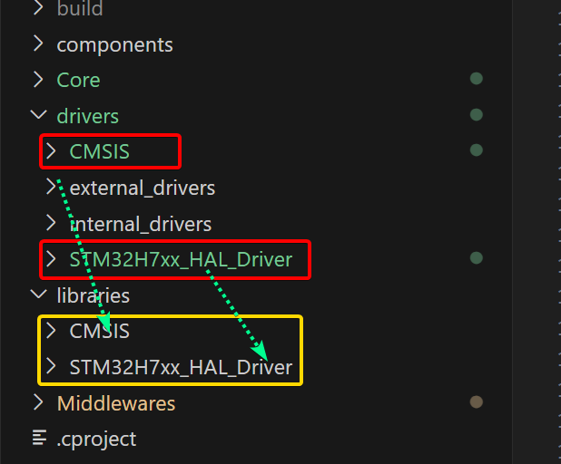

    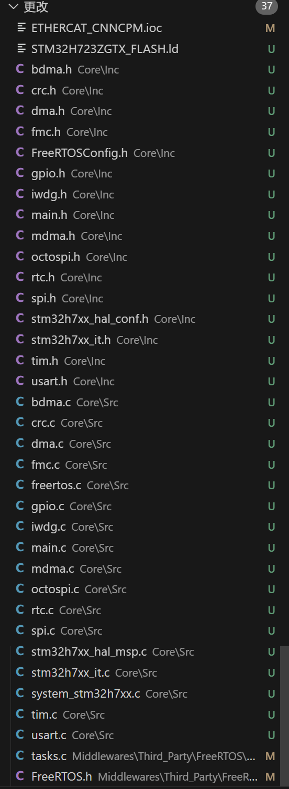

    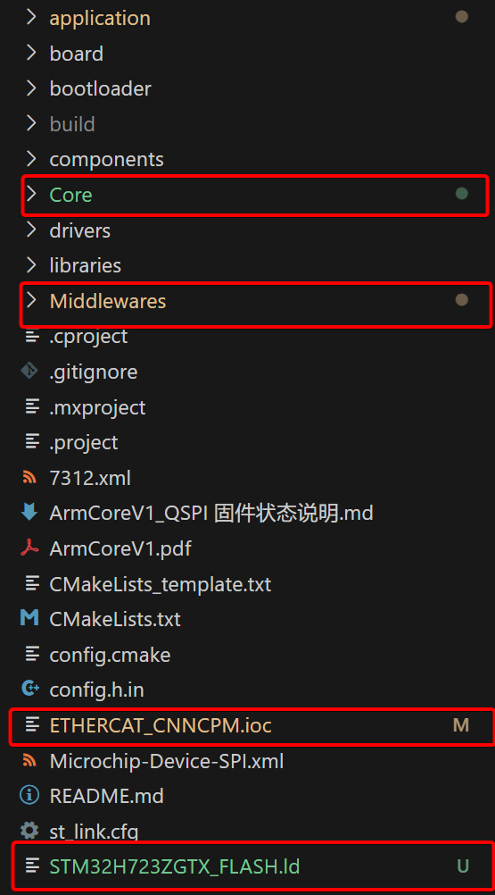

  > `ETHERCAT_CNNCPM.ioc`文件是`STM32CubeMX`的配置文件，记录了硬件的相关配置，**必须保留**，且每次更新硬件配置时均需要更新工程下该文件。
    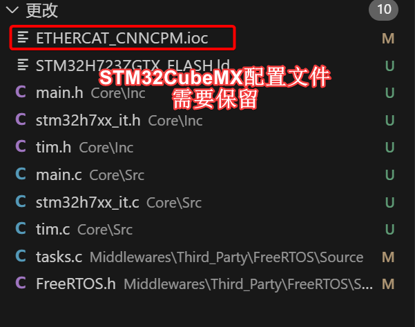

  > `STM32H723ZGTX_FLASH.ld`文件是`STM32CubeMX`的链接脚本文件，需要将其与`board/linker_scripts`目录下的同名文件进行对比，并根据实际情况进行修改。因本demo不涉及链接脚本的修改，故直接删除该文件。
    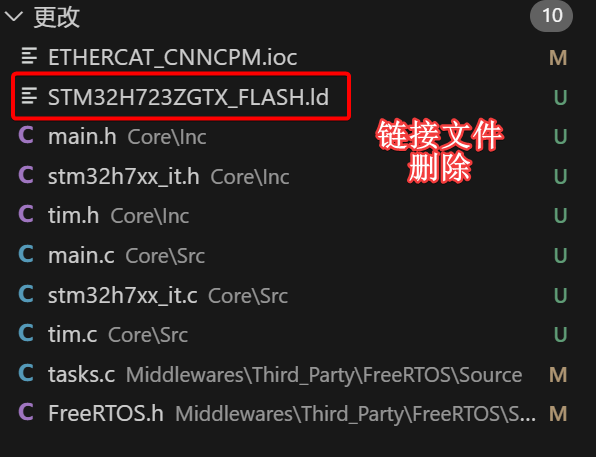

  > `Middlewares`是`STM32CubeMX`的`Middleware and Software Packs`分类菜单生成的中间件文件夹，当前仅放置了`FreeRTOS`相关文件。由于工程中移植了`cm_backtrace`组件用于硬件fault追踪。故，需要保留原文件（在相应文件上点击放弃更改，可直接删除更新的内容）。
    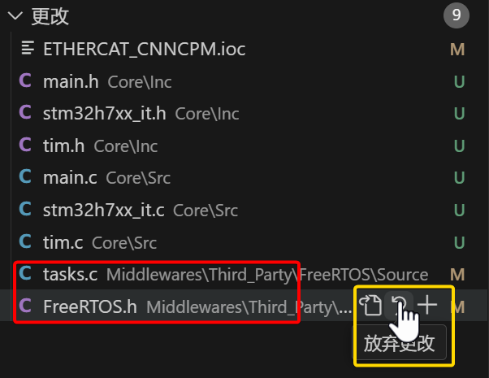

  > 将`Core`目录下，`Inc`和`Src`文件夹中的文件，与`drivers/internal_drivers`文件夹下同名文件进行对比，并修改`drivers/internal_drivers`文件夹下的对应文件内容。本demo只涉及timer的变更，故只需对比修改`tim.h`、`tim.c`、`main.h`、`main.c`、`stm32h7xx_it.h`和`stm32h7xx_it.c`这几个文件。将`Core`文件夹下未涉及文件删除后，如下：
    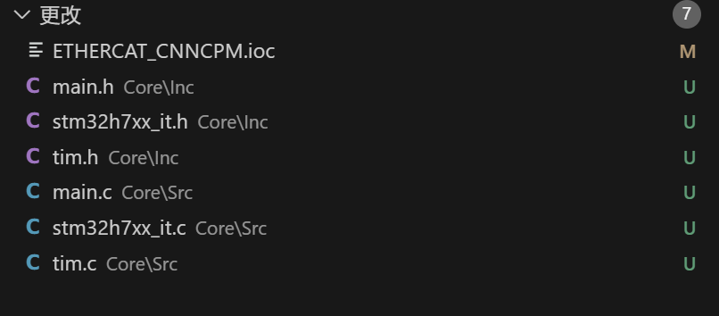

- 修改完成后的文件更改情况
    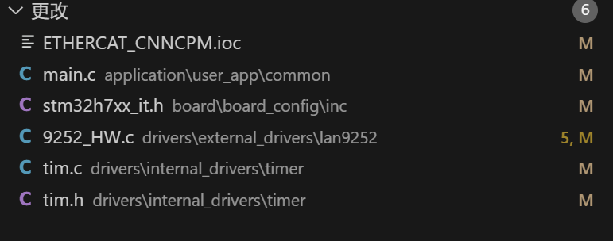

- 若`CmakeLists.txt`文件有修改，则需要重新配置工程（重新生成makefile文件）
    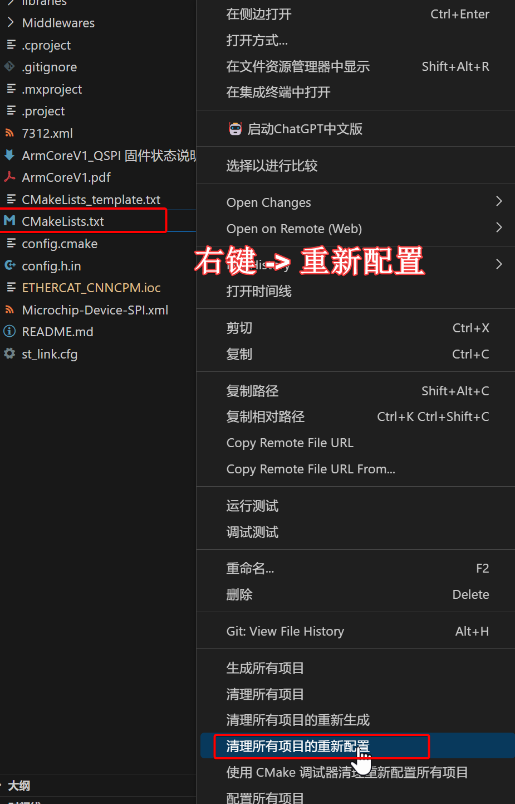

- 编译工程
    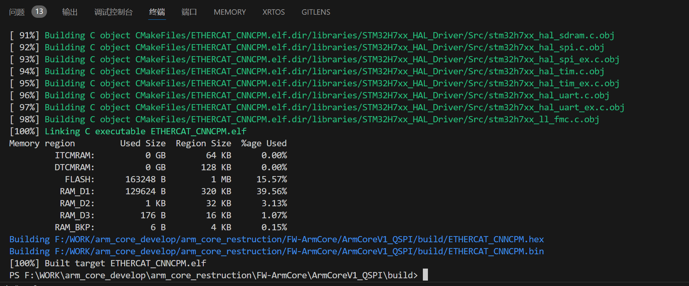

- 下载程序测试
    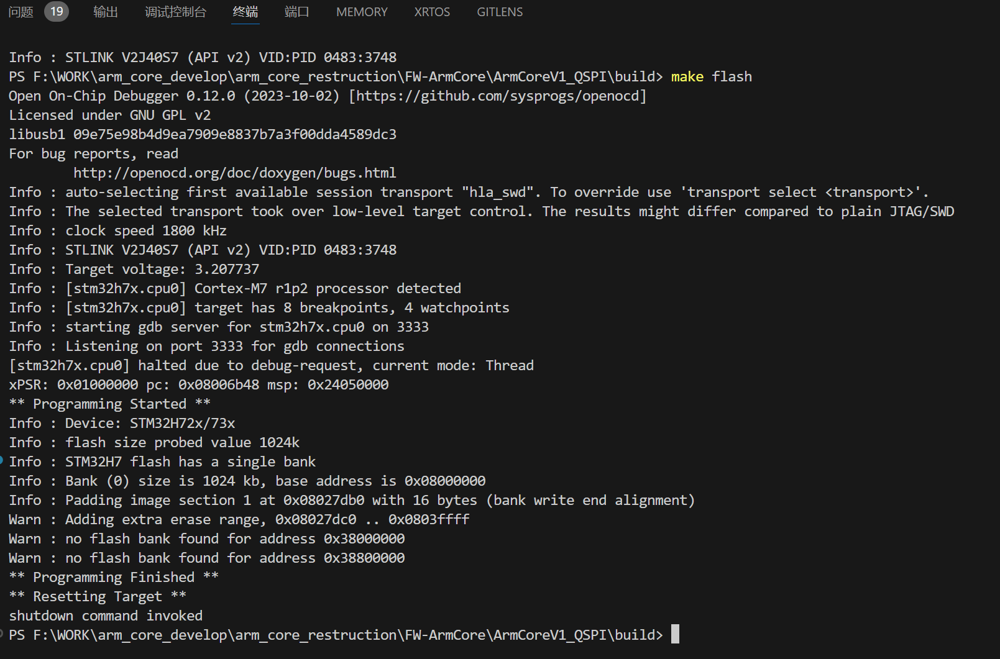

- 至此，完成硬件配置的修改，下一步根据业务需求，编写相应的设备驱动接口。本demo编码器接口实现可参考**SHA-1: b5edeeab0f16bb55d3f87af913d04df3caab39ee**下`encoder_port.h`和`encoder_port.c`文件
